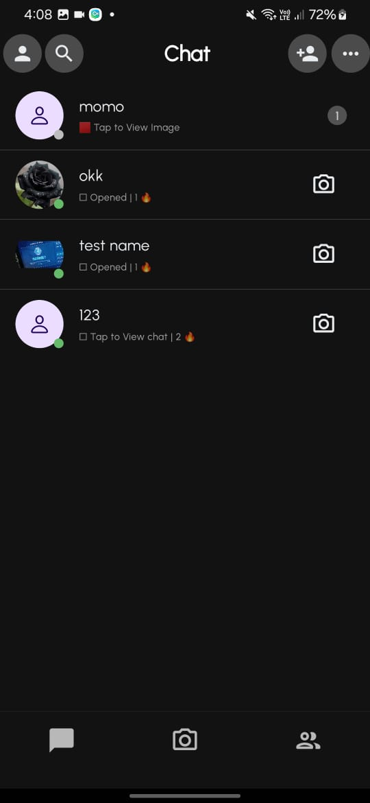
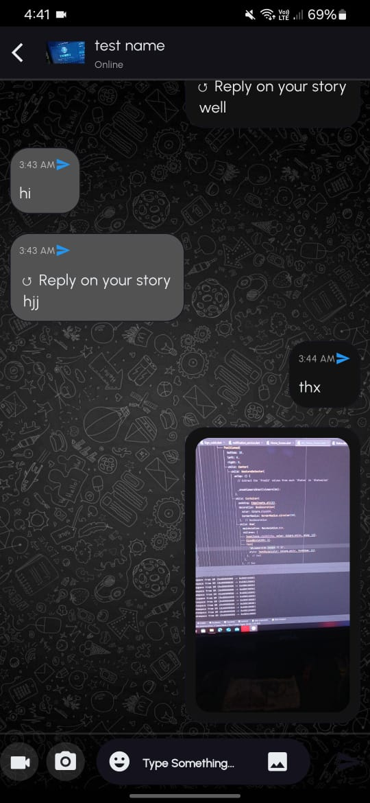
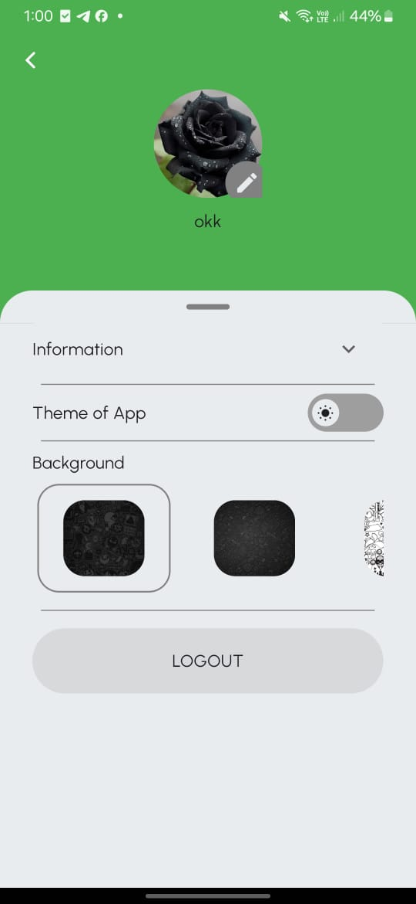
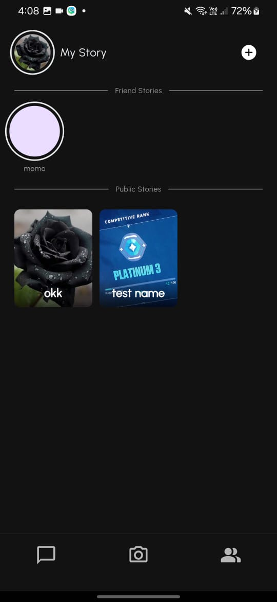
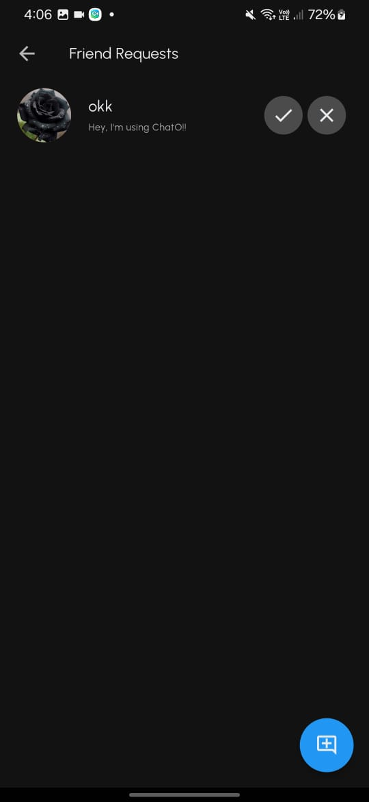
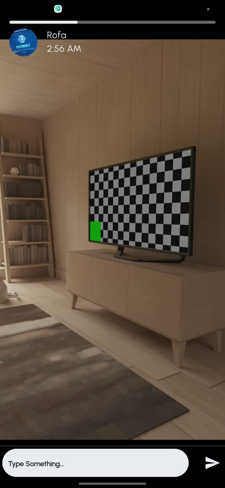
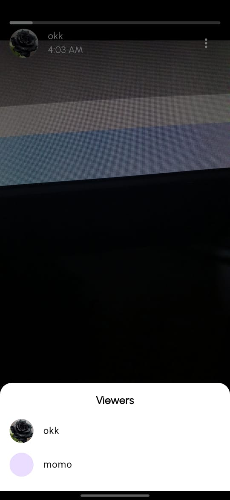

# SnapTime App

A **real-time chat application** built with **Flutter** and **Firebase**, designed to support private messaging, friend requests, and story sharing. This app features an intuitive user interface, scalable data modeling, and real-time updates for a seamless communication experience.

## 📸 Screenshots of the App

| **Screen**            | **Description**               | **Screenshot**                                    |
|------------------------|-------------------------------|--------------------------------------------------|
| **Home Screen**        | Overview of the app's main features. |      |
| **Chat Screen**        | Real-time messaging interface.  |      |
| **Profile Screen**     | User profile with editable details. |  |
| **Status Screen**      | View and manage user stories.   |  |
| **Friend Requests**    | Manage friend requests.         |  |
| **Other User Story**   | Reply to story.                 |  |
| **My Story**           | Seen list & delete story.       |  |


## Features

- **User Management**  
  - Profile setup with profile pictures and user descriptions.
  - Online/offline status tracking.
  - Friend request system with options to send, accept, and reject requests.
  
- **Messaging**  
  - One-on-one chat with real-time updates.
  - Support for text, images, and video messages.
  - Read receipt and delivery tracking.
  
- **Stories**  
  - Add stories with images or videos.
  - Public and private story sharing.
  - Track viewers for each story.
  - Reply to other stories

- **Status Updates**  
  - Real-time status updates with media support Video and image.
  - View which users have seen your status.
  - Delete stories after 24h automatic.
    
- **Notification System**  
  - Push notifications for new messages, friend requests, and story updates.
  
## Database Structure

### Users Collection
Stores user-specific details.

| Field Name       | Type    | Description                            |
|-------------------|---------|----------------------------------------|
| `user_id`         | String  | Document ID for the user.             |
| `name`            | String  | Full name of the user.                |
| `email`           | String  | Email address.                        |
| `profile_picture` | String  | URL to the user's profile image.      |
| `about`           | String  | User's bio or about info.             |
| `push_token`      | String  | Token for push notifications.         |
| `is_online`       | Boolean | Indicates online status.              |
| `last_active`     | Timestamp | Last active time.                    |
| `friend_requests` | Array   | List of pending friend requests.      |
| `my_users`        | Array   | List of user IDs in contact.          |
| `story`           | Number  | Total number of stories shared.       |
| `story_p`         | Number  | Public stories count.                 |
| `story_f`         | Number  | Private stories count.                |

### Chats Collection
Manages one-on-one conversations.

| Field Name         | Type    | Description                               |
|---------------------|---------|-------------------------------------------|
| `conversation_id`   | String  | Unique ID for the conversation.          |
| `messages`          | Collection | Sub-collection of messages.            |

#### Messages Sub-Collection
| Field Name         | Type        | Description                            |
|---------------------|-------------|----------------------------------------|
| `message_id`        | Timestamp   | Unique ID based on timestamp.         |
| `from_id`           | String      | Sender's user ID.                     |
| `to_id`             | String      | Receiver's user ID.                   |
| `msg`               | String      | Message content.                      |
| `type`              | String      | Message type (text/image/video).      |
| `sent`              | Timestamp   | Time the message was sent.            |
| `read`              | Timestamp   | Time the message was read.            |

### Status Collection
Stores user stories and their visibility.

| Field Name    | Type        | Description                              |
|---------------|-------------|------------------------------------------|
| `user_email`  | String      | Unique identifier for user status.       |
| `media`       | Collection  | Sub-collection containing status media. |

#### Media Sub-Collection
| Field Name    | Type        | Description                              |
|---------------|-------------|------------------------------------------|
| `media_id`    | Timestamp   | Unique ID for the media.                |
| `public`      | Boolean     | Indicates if the story is public.        |
| `status`      | String      | URL to image/video.                     |
| `image`       | String      | URL to user's profile picture.          |
| `seen`        | Array       | List of user IDs who have seen the story.|
| `fromname`    | String      | Name of the user who posted the story.  |
| `type`        | String      | Media type (image/video).               |
| `fromId`      | String      | User ID of the story poster.            |
| `sent`        | Timestamp   | Time the story was posted.              |

## Additional Considerations

- **Friend Requests**: A dedicated collection can manage pending friend requests for scalability.
- **Groups**: Separate collection for group chats with metadata and member lists.
- **Reactions**: Messages can include reactions as a list of user IDs or as a sub-collection.

## Setup Instructions

1. Clone the repository:
   ```bash
   git clone https://github.com/NourNabil2/Chat_App.git
